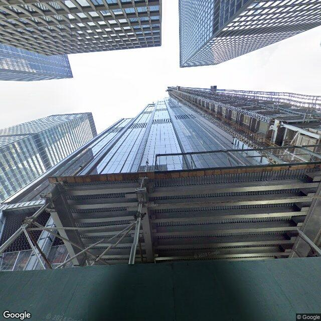

# 2025 Citi x AWS Hackathon - KYC & Source of Wealth (SOW) Verification Workflow
This is a 3-days Citi Wealth Global Hackathon #HackToTheFuture project that leveraging AWS services to deploy a streamlit application for automating and streamlining the KYC and SOW verification process.     

*Automated Client Due Diligence Application*


## 1. Overview
This system automates **KYC (Know Your Customer)** and **Source of Wealth (SOW)** verification by:
- Gathering client data from internal and external sources
- Using AI (Amazon Bedrock, Textract, Transcribe) to analyze documents and calls
- Generating a consolidated **SOW report** for KYC checkers

## 2. Backend Workflow
### AWS services used
1. **EC2 :** Provides resizable virtual servers (instances) in the cloud. Offers flexible OS/software choices, scalable compute capacity, and pay-as-you-go pricing
2. **S3 :** Scalable object storage for data like files, images, and backups. Offers high durability, versioning, access controls, and integration with other AWS services  
3. **Lambda :** Serverless compute service that runs code in response to events (e.g., HTTP requests, file uploads) without managing servers. Scales automatically; pay only for execution time
4. **Bedrock :** Fully managed service for building generative AI applications using foundation models (e.g., text/image generation). Simplifies access to models like Claude or Stable Diffusion via an API
5. **Textract :** Extracts text, structured data (tables, forms), and key-value pairs from scanned documents or images using OCR and machine learning. Automates document processing
6. **Transcribe :** Converts speech to text automatically. Supports audio/video transcription in multiple languages, with speaker identification and real-time processing  
7. **IAM :** Manages user access and permissions for AWS resources. Defines policies, roles, and groups to securely control authentication and authorization  

### Trigger
**Step B1-2:** System detects a **KYC alert** (periodic scan or new client onboarding) and generates a **KYC list** in the database.

### Data Retrieval
**Step B3:** Fetches **client PII** (Personally Identifiable Information) from the internal database.

### External Verification (Parallel Steps)
**Step B4.1:** Triggers **Google StreetView** to capture images of the client's workplace.   
* Event json
```
  {  
   "CLNT_NBR" : "123456704",  
   "ADDRESS" : "270 Park Avenue,. New York City. ,. United States"  
  }
```
* Return  


**Step B4.2:** Runs **web scraping** to collect public data (occupation, salary, location, etc.).  
* Event json
```
  {
   "CLNT_NBR" : "123456704",
   "CUSTOMER_NAME" : "Jamie Dimon",
   "OCCUPATION" : "CEO",
   "COMPANY" : "JPMorgan Chase & Co.",
   "LOCATION" : "270 Park Avenue,. New York City. ,. United States"
  }
```
### Additional Data Collection
**Step B5-7:**
- Sends an **automated email** to the Relationship Manager (RM) if extra data is needed
- RM **calls the client** and call logs are retrieved from the internal recording system

### AI Processing (Parallel Steps)
**Step B8.1:** Call recording is processed by **Amazon Transcribe** with amazon.titan-text-express-v1 to generate subtitles.  
**Step B8.2:** RM uploads **client-submitted documents**.  
**Step B8.3:** Documents are processed by **Textract (OCR)** then **Bedrock** (AI keyword analysis via amazon.titan-text-express-v1).

### Consolidation & Output
**Step B9:**
- Bedrock **analyzes corroboration level** across all data sources with amazon.titan-text-express-v1
- Generates a **final SOW form**

**Step B10:** KYC checker reviews and the **process is complete**.

## 3. Frontend (UI) Workflow

### Case Creation
**Step F0:** User inputs **Client ID** (e.g., `123456704`) to create a new case.

### Case Verification
**Step F1:** Clicks **"Check Client ID"** to confirm case exists. If not, returns to Step F0.

### Data Processing
**Step F2:** Clicks **"Run Data Processing"** to display client data in a table.

### External Agents (Parallel Steps)
**Step F3:** Clicks **"Run StreetView Agent"** to trigger Google StreetView.  
**Step F4:** Clicks **"Run Webscraping Agent"** to trigger web scraping.

### Document Upload (Optional)
**Step F5:** User uploads **supporting documents**.

### Completion
**Step F6:** Downloads **SOW form** and KYC checker takes over.

## 4. Key Features
- **Parallel Processing:** Steps B4.1/B4.2 and B8.1/B8.2/B8.3 run simultaneously
- **AI Integration:** Amazon Bedrock (Nova), Textract, Transcribe
- **Audit Trail:** Call logs, automated emails, and document tracking
