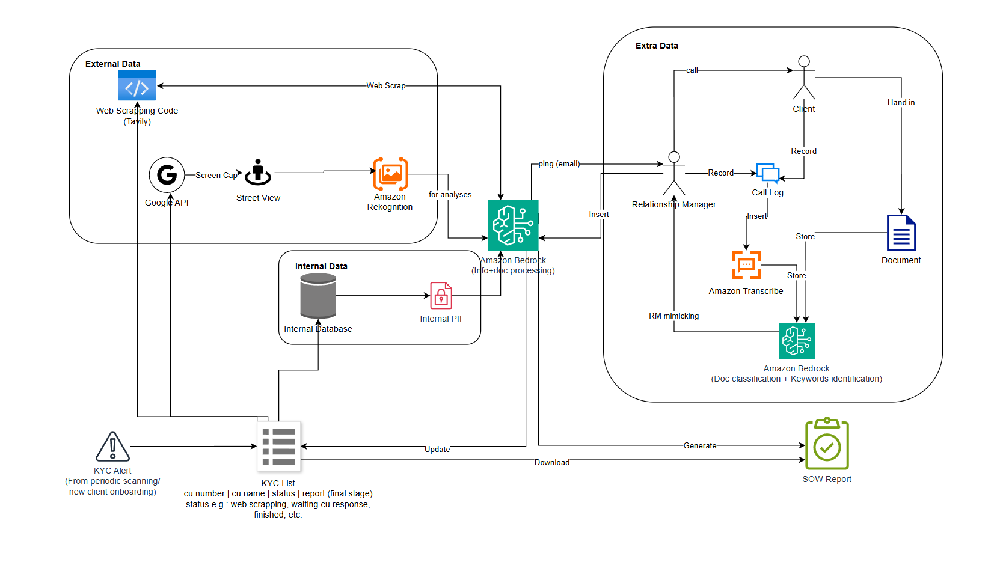

# 2025 Citi x AWS Hackathon  
## KYC - Source of Wealth  



## 1) Google Street View Image Extraction  
This function is to extract the street view image of customer's company address.  
It is triggered by a button event in streamlit user-interface.  

**Lambda Function URL**: <https://us-east-1.console.aws.amazon.com/lambda/home?region=us-east-1#/functions/street_view?tab=code>  

**Environment Variables / Parameters**:    
   <!-- * ADD_SRC_S3_BUCKET : string, S3 bucket for database of customer data  -->
   * GM_API_KEY : string, Personal Google Geocoding API  
   * IMAGE_S3_BUCKET : string, S3 bucket for storing the street view image  
   <!-- * SRC_FILE_NAME : string, S3 bucket for file name of customer data ADD_SRC_S3_BUCKET  -->  
   
**Event json**
```
{  
   "CLNT_NBR" : "123456704",  
   "ADDRESS" : "270 Park Avenue,. New York City. ,. United States"  
}
```

## 2) Amazon Titan Web Searching 
This function is using Amazon Titan Text Express v1 to web scrape customer's working background based on customer name, company name, company address.  
It is triggered by a button event in streamlit user-interface.  

**Lambda Function URL**: <[https://us-east-1.console.aws.amazon.com/lambda/home?region=us-east-1#/functions/street_view?tab=code](https://us-east-1.console.aws.amazon.com/lambda/home?region=us-east-1#/functions/externaldataprocesscode?tab=code)>  

**Environment Variables / Parameters**:    
   <!-- * ADD_SRC_S3_BUCKET : string, S3 bucket for database of customer data  -->
   * FUNC_S3_BUCKET : string, S3 bucket for storing the scraping result
   * GOOGLE_API_KEY : string, Personal Google Geocoding API
   * GOOGLE_CSE_ID : string, Personal Google CSE ID
   <!-- * SRC_FILE_NAME : string, S3 bucket for file name of customer data ADD_SRC_S3_BUCKET  -->

**Event json**
```
{
   "CLNT_NBR" : "123456704",
   "CUSTOMER_NAME" : "Jamie Dimon",
   "OCCUPATION" : "CEO",
   "COMPANY" : "JPMorgan Chase & Co.",
   "LOCATION" : "270 Park Avenue,. New York City. ,. United States"
}
```
